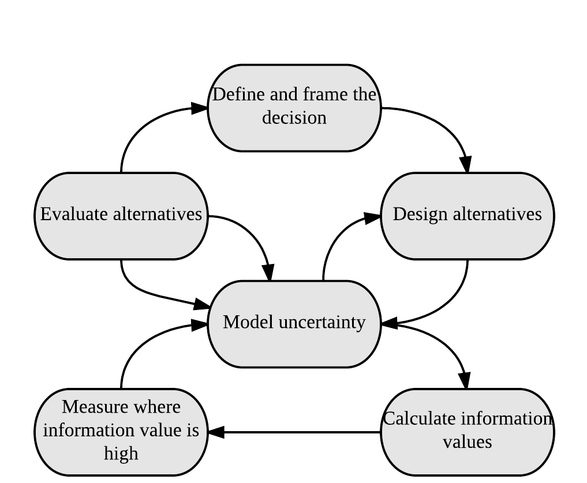

# Introduction

The development community faces increasing demand to credibly link research and development activities with progress towards the envisioned outcomes [@Shepherd_In_Prep_EF_2017]. Improved planning tools for interventions that target complex systems are urgently needed, especially in developing countries where data are scarce and uncertainties about decision outcomes are large.  However, especially where quantitative impact predictions are requested, stakeholders are often left guessing about development outcomes, because they lack reliable tools to forecast impacts. Methodologies that address these uncertainties could transform the way development is done and greatly enhance the efficacy of its activities. Such methods could stimulate thorough scrutiny of research priorities and direct resources to where they lead to the greatest impacts [@Luedeling_Solutions_2016]. For this positive effect to materialize, however, the development community needs better approaches for planning for impact. 
One of the central difficulties in planning for impact is dealing with uncertainty. It is rarely possible to accurately predict the impacts of agriculture for nutrition, and other types of interventions. Many of the important factors that determine these impacts, such as adoption rates, yield increases, the performance of a particular tree or crop in a new environment and future weather, are highly uncertain. Additionally, many development interventions are implemented in risky environments, where extreme weather events, conflict, poor anticipation of cultural preferences, political interference or other risk factors can dramatically disrupt progress at any time [@Luedeling_Wajir_2015]. 

Making impact projections in this environment, especially where precise numbers are expected, is very difficult, and researchers and development workers often find themselves in an ethical quagmire, torn between the perceived need to honestly evaluate risks and the temptation to let wishful thinking guide their estimates. The latter may lead to overly optimistic assumptions and high impact projections that may raise the chance of political and donor support but are essentially unrealistic. This conflict of interest is not only a problem for project proponents – it also compromises the ability of stakeholders to compare impact ‘promises’ across proposals or reported impacts by different projects.

For research that is actually worth doing, results cannot be forecast with certainty (otherwise the research would not be necessary). However, what is currently lacking is a set of reliable methods to produce robust impact projections that take into account the host of uncertainties and risks that research and development activities are faced with. Such methods should be based on quantitative representations of impact pathways that capture the causal mechanisms of impact delivery. This manual aims to provide documentation for disseminating an approach based on Bayesian Networks (BNs) for impact pathway modeling. It seeks to establish Bayesian Networks (BNs) as a widely used analysis tool for development decisions related to agriculture for nutrition.

##Predicting impacts of Agriculture for Nutrition activities

Many activities in agricultural research and development aim at improving nutrition, but they are often unable to articulate clearly how nutrition objectives will be achieved and to what degree. Agricultural systems in developing countries are complex, and few agricultural interventions can be expected to impact such systems in a linear way. Thus there is a need for new approaches for analyzing the impacts of agricultural interventions on food and nutrition systems.

The success of an intervention will always depend on a number of factors that interact in ways that would be difficult or impossible to predict with precision. Some examples of these difficult-to-measure factors are the so-called ‘intangible’ factors, such as people’s perceptions of healthy food and their food preferences. The nutritional status of a country’s population is determined by many such factors, including, of course, the nutritional value of the food people eat, but also a complex interplay between the food environment, household economics, health, education, and agricultural value chains [@Waage_2012]. Thus, many pathways may have the potential to improve national nutrition, e.g. through higher nutrient contents in crops [@Della_1999; @Nestel_2006], greater nutritional diversity [@Hoddinott_2002] or improved awareness about childhood nutrition [@Ruel_2013]. For any given context, however, it is difficult to decide *a priori*, which pathway will be most effective. Some pathways may not produce positive outcomes at all, if, for instance, the value chain degrades the nutritional value of the food, or if certain foods never reach vulnerable groups (e.g. children or lactating women). 

Credible impact pathways regarding agriculture for nutrition should reflect their complexity. However, there is currently a severe shortage of practical methods that allow credible analysis of these complex systems. Most conventional scientific approaches are unable to deal with this complexity. Opportunities for controlled trials are very limited, especially at low cost, and simple statistical tools (regressions, correlations) do not provide much information about the way that drivers of agricultural systems are related to nutritional (and other) outcomes.

Use and analysis of impact pathways have helped to show how interventions function, where they are lacking and what can be done to improve them. @Leroy_2009, for example, used impact pathway models to review the effect of cash transfer programs on child nutrition outcomes. @Olney_2009, used impact pathway models to evaluate the maternal and child health and nutrition effects of a homestead food production program in Cambodia and found that household-level benefits from the program did not translate into significant improvements in maternal and child health and nutrition. Both studies found a major gap in implementer and stakeholder knowledge about how the programs improve nutrition and identified this as a major obstacle to the interventions. 

This manual provides a step by step guide to help synthesize expert knowledge and other sources of information into BN models that provide credible probabilistic projections of the impact of decisions. The methods described can be applied to multiple nutrition outcomes. The resulting models, as well as the participatory process from which they emerge, can be used to define useful metrics for monitoring progress towards nutrition outcomes. To achieve this, this manual demonstrates a Bayesian approach, which seeks to express the current state of uncertainty on everything that matters to a decision, can help to focus the measurement effort on areas that can narrow uncertainty to reduce ambiguity in the decision. Analysts can then update BNs based on the new information. Whether a factor is seemingly easy or difficult to measure or has existing data available has no bearing on its inclusion. Omitting an important factor is essentially prescribing it as valueless. This is then complemented with innovative group work techniques for eliciting expert knowledge to construct a logical framework to describe system interactions and outcomes (i.e. an impact pathway). Expert knowledge is thereby used to generate BN model structures [@Bolger_2015; @Papakosta_2017; @Kuhnert_2010] and these are then integrated into model calculations [cf. @Yet_2016]. 

##Decision Analysis

Decision Analysis provides a framework for development research. Its objective is to facilitate better decisions by gaining insights into what actions could most increase multiple benefits given stakeholder preferences, while minimizing costs and risks. Abbas & Howard (2015) illustrate how the foundations of Decision Analysis provide the norms for decision making. The basic Decision Analysis approach seeks to increase benefits and decrease risks on a continuous basis through the intervention planning and implementation process. The insights gained through the Decision Analysis approach include better understanding of the magnitude of the trade-offs among different development objectives relative to the preferences of different stakeholder groups. The ultimate aim is to lead to clarity of action for decision makers

The basic steps in the Decision Analysis process, see \autoref{Fig_Diagram_Shepherd}, address the questions of both why and how decisions are formulated and factors are measured. Hubbard_2014 outlines some of these approaches as part of his Applied Information Economics (AIE), which he calls the 'Universal Modeling Approach', since AIE has the basic premise that if something has an affect, it must be observable, and if it is observable it must be measurable. Decision Analysis and AIE are a collection of decision theory and risk analysis tools which use:

\begin{itemize}
  \item calibrated probability assessment (discussed in more detail in \autoref{calibration-training}) 
  \item value of additional information calculations applied to uncertain variables in a decision model, the results of which will reveal where to focus efforts to reduce uncertainty (e.g. by model refinement or by making further measurements).
  \item empirical methods applied according to the information value of the measurement. 
\end{itemize}

\autoref{Fig_Diagram_Shepherd} shows a technical diagram of the Decision Analysis process adapted from @Shepherd_In_Prep_EF_2017. The process outlined is followed in cooperation with key stakeholders and experts to improve the design of policy and interventions and monitor their impacts. The loop in the top half of the diagram describes the process that evaluates different alternatives in relation to the decision goals, whereas the lower loop uses value of information analysis to determine what should be measured to clarify the decision. There are iterative feedback loops throughout the process.

  

The merits of the application of the Decision Analysis tools for development decisions have been further described in detail. @Luedeling_Solutions_2016 point out that Decision Analysis solves the problem of data gaps, which has often prevented research from comprehensively and holistically forecasting decision impacts. It also allows explicit consideration of risks and variability.

Decision Analysis tools allow for decision making that draws on all appropriate sources of evidence rather than rule out intangible and hard to measure aspects of a decision. @Luedeling_Solutions_2016 point out that, in Decision Analysis, a model should include all the factors and all the important decision impacts that experts consider relevant, regardless of data availability. @Shepherd_2015 points out that Decision Analysis tools are particularly useful in development contexts, where data are often sparse. One very useful aspect of the approach is that expert knowledge can be used to fill in the knowledge gaps and avoid missing important factors when deciding about development interventions. 

