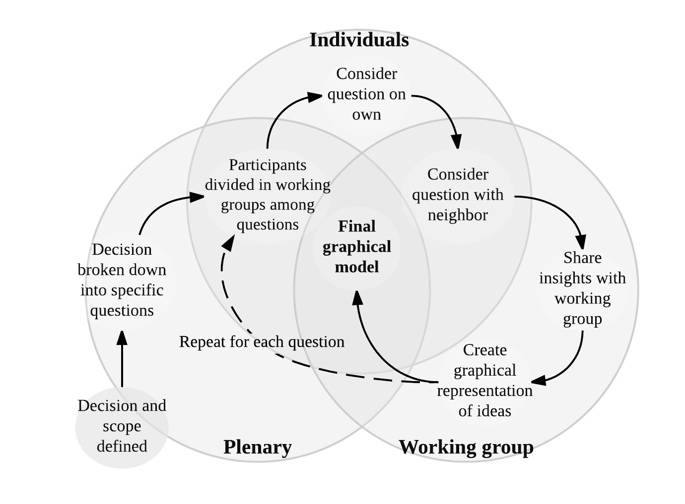

## Generating a graphical model
 
The next step in the Decision Analysis process is to jointly develop a decision model (\autoref{Fig_Diagram_Shepherd}). In the workshop setting it is important for the analyst to gather all the variables that the expert group agrees are logically important to describe the impact pathway of the decision and include them in the model. This should be done regardless of the ease of measurement of the individual variables. 

Before engaging in this process the overall context for the model (the decision that was identified) should be defined explicitly and agreed upon in plenary discussions with the identified experts. Once this has been done, building the graphical model can begin. In our approach we start from the decision framing step through to the model development by asking experts to work together and peer review each others work. 

@Bolger_2015 and @Bolger_2017 point out the various challenges in handling expert knowledge, which include both poor judgment regarding probability and high levels of variation among experts. These problems occur because experts are not trained to formulate reliable representations of uncertainty, many lack experience with probability and few learn to express their uncertainty as probability distributions. Here we outline several important steps that should be taken to aid in the process of collaboratively building model structures and making variable estimates. These will help to ensure accuracy in the process.

### Colaborative approaches

Tools are available to help overcome these problems. According to @Bolger_2015 it is possible to create better conditions for gathering expert knowledge. These include offering experts experiences in making estimates for well-defined targets, offering tools on which to base their estimates, and offering regular and usable feedback about the accuracy of their estimates. @Bolger_2017 experts can be a source of quality data about the future. Ensuring the quality of this data starts by selecting the best experts, training experts in the normative aspects of anticipation and combining judgments from several experts.

Here we illustrate some useful approaches for combining experts probability distributions, using the accumulated information from multiple experts. In this approach a workshop is held and graphical models are developed by individual experts and then peer reviewed by other experts. These approaches allow analysts to obtain as much information as possible and gather data that represent a summary of expert opinion. More examples of these tools in practice are shown by @Clemen_1999 and @Bolger_2017.   

\autoref{Fig_Elicit_Proc} has been adapted from @Whitney_In_Prep_EF_2017, it illustrates a process that can be used for eliciting graphical representations of decisions from expert groups to be used in developing a BN. This approach is generally outlined in the work of @Iqbal_2010, who consulted experts in repeated group meetings to build a BN for defoliation prediction by sawfly infestations in Newfoundland. Each expert was asked to create a BN model and this was then peer reviewed by other experts. In our approach the process begins with breaking the decision down into several important questions in plenary discussions. Random interchanging working groups of experts are then led through three stages of collaborative thinking for each question that is brought up, these are:

\begin{enumerate}
  \item Consider the question alone. Experts are given a short time (usually a minute or two) for quiet reflection and writing on the question
  \item Share with immediate neighbor. Experts are given some time (usually a few minutes) to compare notes and ideas on the question with another participant in the working group.
  \item Share with working group and design. Working groups are given as much time as necessary to discuss and design a model of their collective understanding of the functional pathways related to the question.
\end{enumerate}

The steps defined above and shown in \autoref{Fig_Elicit_Proc} are designed to help experts interact, brainstorm and help reach common understanding about impact pathways. Through this approach, experts can explore details of the expected impacts, disaggregate the impact pathway into the intermediate steps and identify all the influencing factors that they consider important to the decision (i.e. draw a model of nodes and edges; cf. \autoref{Fig_UG_BN}).
 
  

The steps shown in \autoref{Fig_Elicit_Proc} are repeated until all experts have worked on each question and are satisfied that all specific relationships have been identified. This iterative process of building a model in the workshop is illustrated conceptually in \autoref{Fig_Elicit_Proc}. Participants should be encouraged to discuss any factors they deem important for the decision, in particular the various costs, benefits, and risks associated with interventions, as well as the objectives and concerns of decision-makers and stakeholders.  The model should have the broad aim to describe the effects of agricultural decisions on specific nutrition outputs such as hunger (a.k.a. global energy and macronutrient deficiency). 

Following this approach, it is important that the analysts have an overview of the process with the objective of building a final working BN model in mind. Analysts should work to guide the experts so that they think about how model parameters interact in a logical way. For example the work of @Whitney_In_Prep_EF_2017 illustrates the use of the EKE approach to build an impact model which aims to deliver the probabilities for different states of malnutrition under a policy decision and to relate this directly to a monetary value for calculating variables of importance (see \autoref{multivariate-analysis})

Resulting models can then be brought before the whole group of experts for plenary discussion and re-drawn, aiming for common understanding about the relationships in each model. The end result should be one model per question with the contributions of all experts. These can then be combined into one large impact pathway model. Corrections and further feedback can be gathered for model verification as a final stage of model development. 

