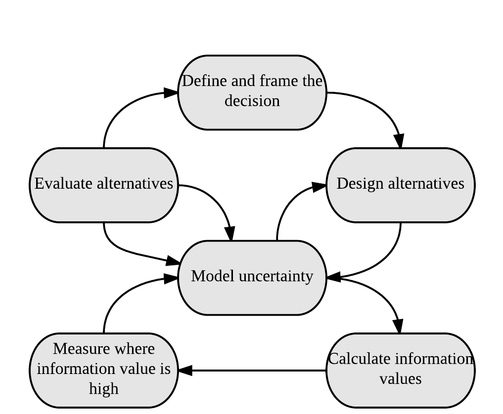
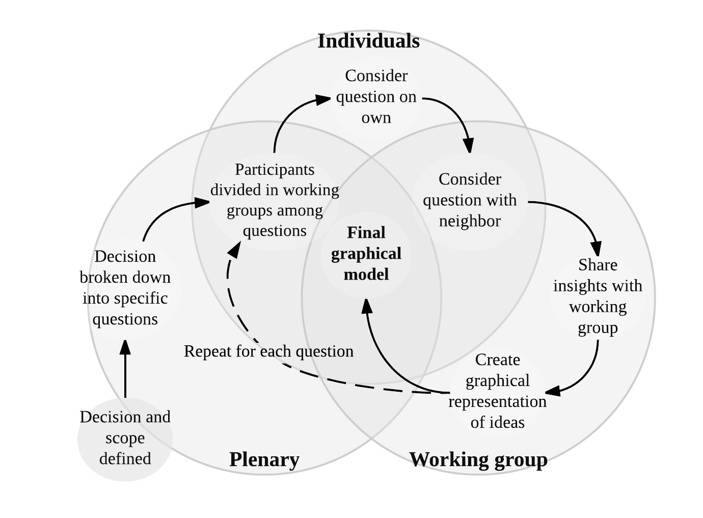
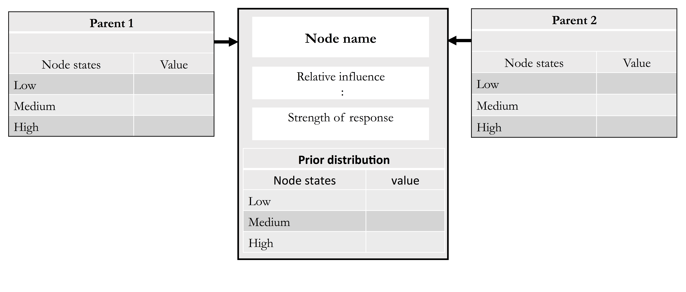
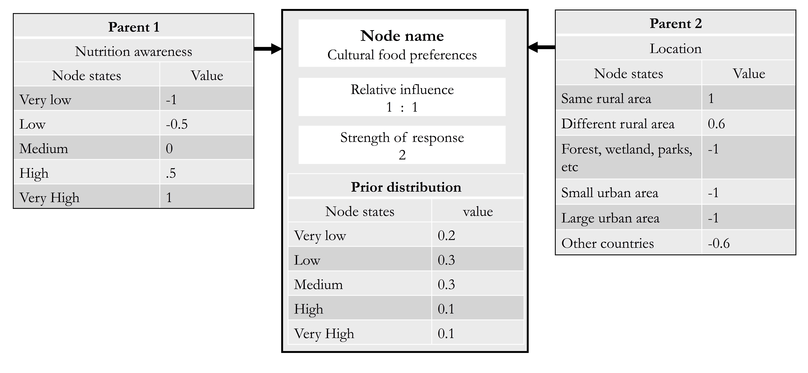
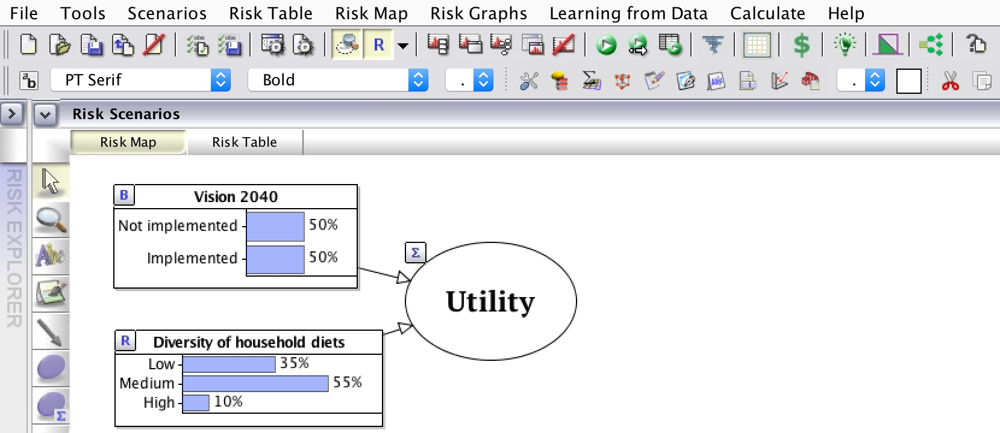
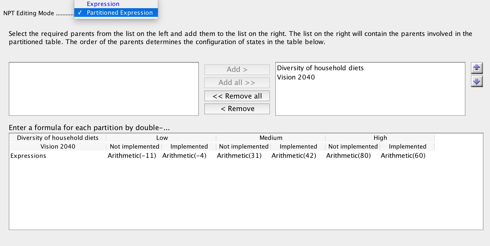
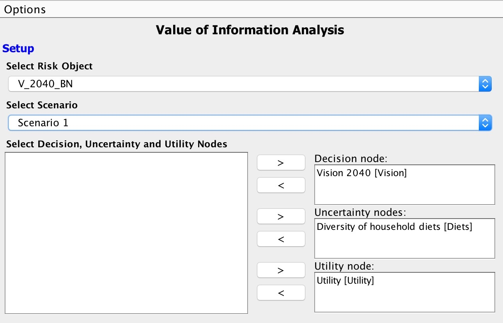

<!-- add    toc: yes to YAML for Table of Contents
add 
devtools::install_github("rstudio/bookdown") 
To run LaTeX
devtools::install_github('yihui/tinytex')
tinytex::install_tinytex()
--> 

<!-- Suggest we target Rural 21 with this manuscript http://www.rural21.com/home/ --> 

\tableofcontents
\listoffigures
\listoftables 

**List of abbreviations**

\begin{itemize}
  \item Applied Information Economics (AIE)
  \item Bayesian Network (BN)
  \item Conditional Probability Tables (CPTs)
  \item Confidence Interval (CI)
  \item Expected Monetary Value (EMV)
  \item Expected Value or perfect information (EVPI)
  \item Node Probability Table (NPT)
  \item Value of Information (VoI)
\end{itemize}

# Summary {-}

It is often very difficult to make accurate projections about how interventions will affect the real world and to use such projections to develop effective implementation plans, monitor progress and evaluate project impacts. This is due to a variety of factors including lack of data, complex impact pathways, and risks and uncertainties that are difficult to factor into intervention planning. Scientific approaches to produce reliable impact projections are rarely applied in agricultural development, but Decision Analysis techniques commonly used in other fields have the potential to improve development decisions. This manual outlines a Decision Analysis approach that can help decision-makers efficiently allocate resources for the most effective policy impacts. 

The procedures outlined in this manual feature the construction of causal models – models that describe the mechanisms through which intervention impacts will be delivered – that are co-developed by experts, stakeholders and analysts through facilitated participatory processes. These models are then formalized as Bayesian Network (BN) models, a modeling approach that has been widely applied in a range of disciplines, including medical sciences, genetics, environmental sciences, and legal reasoning. BNs allow for the formal representation of causal models, such as intervention impact pathways. They can work effectively with incomplete information, combine expert knowledge with other sources of information, and they allow adequate consideration of risk.

This manual illustrates the use of participatory workshops that convene experts on the systems, stakeholders involved in ongoing or prospective projects, and analysts. These teams can jointly develop impact pathways for the interventions, which can be formalized into quantitative BN models. After several rounds of feedback elicitation, and inclusion of data from experts and other sources, stochastic simulations can be run to determine the likely impacts of the interventions. Results can be presented back to stakeholders for feedback. 

Through the tools laid out in this manual critical uncertainties in the models of intervention impact pathways can be identified. These high-value variables can determine uncertainty about project outcomes. Further measurement or dissagregation of these variables could greatly support decision-making processes. 

By demonstrating improved intervention decisions with little additional investment and improved tools for intervention decision modeling, we hope that this approach will be widely adopted and used to enhance the efficacy of development activities.

# Introduction

The development community faces increasing demand to credibly link research and development activities with progress towards the envisioned outcomes [@Shepherd_In_Prep_EF_2017]. Improved planning tools for interventions that target complex systems are urgently needed, especially in developing countries where data are scarce and uncertainties about decision outcomes are large.  However, especially where quantitative impact predictions are requested, stakeholders are often left guessing about development outcomes, because they lack reliable tools to forecast impacts. Methodologies that address these uncertainties could transform the way development is done and greatly enhance the efficacy of its activities. Such methods could stimulate thorough scrutiny of research priorities and direct resources to where they lead to the greatest impacts [@Luedeling_Solutions_2016]. For this positive effect to materialize, however, the development community needs better approaches for planning for impact. 
One of the central difficulties in planning for impact is dealing with uncertainty. It is rarely possible to accurately predict the impacts of agriculture for nutrition, and other types of interventions. Many of the important factors that determine these impacts, such as adoption rates, yield increases, the performance of a particular tree or crop in a new environment and future weather, are highly uncertain. Additionally, many development interventions are implemented in risky environments, where extreme weather events, conflict, poor anticipation of cultural preferences, political interference or other risk factors can dramatically disrupt progress at any time [@Luedeling_Wajir_2015]. 

Making impact projections in this environment, especially where precise numbers are expected, is very difficult, and researchers and development workers often find themselves in an ethical quagmire, torn between the perceived need to honestly evaluate risks and the temptation to let wishful thinking guide their estimates. The latter may lead to overly optimistic assumptions and high impact projections that may raise the chance of political and donor support but are essentially unrealistic. This conflict of interest is not only a problem for project proponents – it also compromises the ability of stakeholders to compare impact ‘promises’ across proposals or reported impacts by different projects.

For research that is actually worth doing, results cannot be forecast with certainty (otherwise the research would not be necessary). However, what is currently lacking is a set of reliable methods to produce robust impact projections that take into account the host of uncertainties and risks that research and development activities are faced with. Such methods should be based on quantitative representations of impact pathways that capture the causal mechanisms of impact delivery. This manual aims to provide documentation for disseminating an approach based on Bayesian Networks (BNs) for impact pathway modeling. It seeks to establish Bayesian Networks (BNs) as a widely used analysis tool for development decisions related to agriculture for nutrition.

##Predicting impacts of Agriculture for Nutrition activities

Many activities in agricultural research and development aim at improving nutrition, but they are often unable to articulate clearly how nutrition objectives will be achieved and to what degree. Agricultural systems in developing countries are complex, and few agricultural interventions can be expected to impact such systems in a linear way. Thus there is a need for new approaches for analyzing the impacts of agricultural interventions on food and nutrition systems.

The success of an intervention will always depend on a number of factors that interact in ways that would be difficult or impossible to predict with precision. Some examples of these difficult-to-measure factors are the so-called ‘intangible’ factors, such as people’s perceptions of healthy food and their food preferences. The nutritional status of a country’s population is determined by many such factors, including, of course, the nutritional value of the food people eat, but also a complex interplay between the food environment, household economics, health, education, and agricultural value chains [@Waage_2012]. Thus, many pathways may have the potential to improve national nutrition, e.g. through higher nutrient contents in crops [@Della_1999; @Nestel_2006], greater nutritional diversity [@Hoddinott_2002] or improved awareness about childhood nutrition [@Ruel_2013]. For any given context, however, it is difficult to decide *a priori*, which pathway will be most effective. Some pathways may not produce positive outcomes at all, if, for instance, the value chain degrades the nutritional value of the food, or if certain foods never reach vulnerable groups (e.g. children or lactating women). 

Credible impact pathways regarding agriculture for nutrition should reflect their complexity. However, there is currently a severe shortage of practical methods that allow credible analysis of these complex systems. Most conventional scientific approaches are unable to deal with this complexity. Opportunities for controlled trials are very limited, especially at low cost, and simple statistical tools (regressions, correlations) do not provide much information about the way that drivers of agricultural systems are related to nutritional (and other) outcomes.

Use and analysis of impact pathways have helped to show how interventions function, where they are lacking and what can be done to improve them. @Leroy_2009, for example, used impact pathway models to review the effect of cash transfer programs on child nutrition outcomes. @Olney_2009, used impact pathway models to evaluate the maternal and child health and nutrition effects of a homestead food production program in Cambodia and found that household-level benefits from the program did not translate into significant improvements in maternal and child health and nutrition. Both studies found a major gap in implementer and stakeholder knowledge about how the programs improve nutrition and identified this as a major obstacle to the interventions. 

This manual provides a step by step guide to help synthesize expert knowledge and other sources of information into BN models that provide credible probabilistic projections of the impact of decisions. The methods described can be applied to multiple nutrition outcomes. The resulting models, as well as the participatory process from which they emerge, can be used to define useful metrics for monitoring progress towards nutrition outcomes. To achieve this, this manual demonstrates a Bayesian approach, which seeks to express the current state of uncertainty on everything that matters to a decision, can help to focus the measurement effort on areas that can narrow uncertainty to reduce ambiguity in the decision. Analysts can then update BNs based on the new information. Whether a factor is seemingly easy or difficult to measure or has existing data available has no bearing on its inclusion. Omitting an important factor is essentially prescribing it as valueless. This is then complemented with innovative group work techniques for eliciting expert knowledge to construct a logical framework to describe system interactions and outcomes (i.e. an impact pathway). Expert knowledge is thereby used to generate BN model structures [@Bolger_2015; @Papakosta_2017; @Kuhnert_2010] and these are then integrated into model calculations [cf. @Yet_2016]. 

##Decision Analysis

Decision Analysis provides a framework for development research. Its objective is to facilitate better decisions by gaining insights into what actions could most increase multiple benefits given stakeholder preferences, while minimizing costs and risks. Abbas & Howard (2015) illustrate how the foundations of Decision Analysis provide the norms for decision making. The basic Decision Analysis approach seeks to increase benefits and decrease risks on a continuous basis through the intervention planning and implementation process. The insights gained through the Decision Analysis approach include better understanding of the magnitude of the trade-offs among different development objectives relative to the preferences of different stakeholder groups. The ultimate aim is to lead to clarity of action for decision makers

The basic steps in the Decision Analysis process, see \autoref{Fig_Diagram_Shepherd}, address the questions of both why and how decisions are formulated and factors are measured. Hubbard_2014 outlines some of these approaches as part of his Applied Information Economics (AIE), which he calls the 'Universal Modeling Approach', since AIE has the basic premise that if something has an affect, it must be observable, and if it is observable it must be measurable. Decision Analysis and AIE are a collection of decision theory and risk analysis tools which use:

\begin{itemize}
  \item calibrated probability assessment (discussed in more detail in \autoref{calibration-training}) 
  \item value of additional information calculations applied to uncertain variables in a decision model, the results of which will reveal where to focus efforts to reduce uncertainty (e.g. by model refinement or by making further measurements).
  \item empirical methods applied according to the information value of the measurement. 
\end{itemize}

\autoref{Fig_Diagram_Shepherd} shows a technical diagram of the Decision Analysis process adapted from @Shepherd_In_Prep_EF_2017. The process outlined is followed in cooperation with key stakeholders and experts to improve the design of policy and interventions and monitor their impacts. The loop in the top half of the diagram describes the process that evaluates different alternatives in relation to the decision goals, whereas the lower loop uses value of information analysis to determine what should be measured to clarify the decision. There are iterative feedback loops throughout the process.

  

The merits of the application of the Decision Analysis tools for development decisions have been further described in detail. @Luedeling_Solutions_2016 point out that Decision Analysis solves the problem of data gaps, which has often prevented research from comprehensively and holistically forecasting decision impacts. It also allows explicit consideration of risks and variability.

Decision Analysis tools allow for decision making that draws on all appropriate sources of evidence rather than rule out intangible and hard to measure aspects of a decision. @Luedeling_Solutions_2016 point out that, in Decision Analysis, a model should include all the factors and all the important decision impacts that experts consider relevant, regardless of data availability. @Shepherd_2015 points out that Decision Analysis tools are particularly useful in development contexts, where data are often sparse. One very useful aspect of the approach is that expert knowledge can be used to fill in the knowledge gaps and avoid missing important factors when deciding about development interventions. 

##Bayesian Networks

Bayesian Networks (BNs) are a powerful tool for analyzing causal relationships in complex systems, for integrating different sources of knowledge, and for dealing effectively with imperfect information. BNs constructed with participation from key stakeholder groups could provide a rapid robust way of applying existing knowledge to forecast intervention outcomes. This technique is practically absent from the planning of agricultural interventions for nutrition outcomes, even though it is well suited for many of the analytic challenges that researchers in this field have been struggling with. Introduction of BNs into this field could greatly enhance the way projects are planned, monitored and evaluated.

BNs have been in use since the 18th century to determine the probability of an event based on prior knowledge about the event. According to @Nielsen_2009 BNs are directed acyclic graphs consisting of nodes arcs and probability tables underlying the nodal relationships. This means that BNs are based on direct causal relationships and do not contain logical loops, instead they are formulated as directed and acyclic models, as in a family tree. A BN is a network of probabilistic relationships between variables (called nodes in the Bayesian nomenclature), referred to as child and parent nodes according to their arrangement in the model (cf. \autoref{Fig_UG_BN}). Conditional Probability Tables (CPTs) are the core elements of BN models [@Fenton_2012]. They are used to define the probabilities for each state of each child node conditional on its parents [@Papakosta_2017]. This allows analysts and experts to represent qualitative nodes as abstractions of the underlying continuous quantities. As an example in \autoref{Fig_UG_BN} the variable *Food Preferences* was considered important for experts, but was difficult to quantify. Therefore it is represented as having the states 'very low', 'low', 'medium', 'high', and 'very high'. The CPT for this variable is populated with the probabilities for these different states given the states of the parents *Location* and *Nutrition awareness*. 

BN models are distinct from other forms of statistical models, in that they focus on determining an optimal graphical model to describe probabilistic inter-relationships among processes rather than on specific measurement data. BN models are a multivariate technique, which can accommodate one or many dependent variables. The approach can be used to investigate risk factors and causal pathways, which is important in health-related systems [cf. @Lewis_Health_2012]. The key distinction between standard multivariate analyses and BN models is that multivariate regressions seek to identify covariates associated with some outcome variables. BN models, on the other hand, attempt not only to identify associated variables but also to separate them into those that have a direct and those that have an indirect influence on the outcome variables [@Lewis_BN_2012]. This gives BN models the potential to reveal far more about key features of complex systems [@Constan_2016; @Lewis_Health_2012] and may make them preferable to standard approaches for inferring statistical dependencies from complex observational data [@Lewis_Health_2012; @Korb_2004]. According to studies such as @Papakosta_2017, another major advantage of BN models is that they facilitate integration of information from various sources into a single model. @Yet_2016 also shows how BNs can be used to build predictive models of impact pathways that incorporate both hard data and expert judgment. Despite their widespread applications BNs have not been exploited in the agriculture/nutrition domain. Yet, BNs are highly suited to this domain. For example, @Hendersen_2004 show how BNs are able to combine information from various sources, such as hard data and expert knowledge, into comprehensive causal models that result in more accurate impact forecasts than using data or expert knowledge alone. 

This manual shows how to adapt and apply BN-based procedures for developing comprehensive impact pathways for agriculture for nutrition interventions and demonstrate their ability to aid in decision-making under multiple uncertainties and imperfect information. The manual acts as a guide to construct robust and reliable impact models by convening experts in the fields of agriculture and nutrition, as well as related disciplines. The modeling approach has several advantages. First, it allows for comparison of the prospects of different interventions for improving nutrition security, thus helping to identify the most promising approaches. Second, it allows for the consideration of risks to intervention success and identification of weak links in the impact pathway that require particular attention by intervention planners. Third, it permits the inclusion of difficult to measures factors that are commonly omitted from models, opening opportunities for holistic research. Lastly, it helps prioritize metrics that will be critical to monitor during implementation – especially those variables that have large residual uncertainty and a large potential impact on intervention outcomes.

#Steps in the Decision Analysis process

##Decision framing

Decision framing is the first part of the decision analysis process, it determines the boundaries of a decision and is the most important aspect of making a good decision. Decision framing starts by identifying both a decision to be modeled and the relevant experts. This is not as simple as it sounds and should be undertaken carefully and with a lot of forethought. Consideration of the criteria which define a decision can help to help add structure to this important step in the process: 

\begin{itemize}
  \item it is a choice between two or more alternatives that involves an irrevocable allocation of resources, 
  \item it involves uncertainty (as we pointed out earlier the analysis would not be necessary if results could be forecast with certainty).
  \item it involves a decision maker or decision making body (who will allocate resources or act).
\end{itemize}

As @Shepherd_In_Prep_EF_2017 points out, in order to to achieve clarity in decision making each of the above elements, and the preferences of the decision maker, need to be carefully defined. 

Once the decision has been identified, the decision analysts then identify and convene relevant decision-makers, stakeholders, and any additional experts. We find that around 20 experts makes for a manageable workshop, more can be cumbersome, especially when dealing with model building in plenary. 

It is important to have a number of different types of knowledge holders involved in the development of the impact model. Therefore, expert selection should seek to gather experts with knowledge on as many aspects of the decision as possible. As @Fenton_2012 points out, expert knowledge is often vital in identifying critical, underlying causal factors that affect risks and opportunities that would otherwise have been missed based on available data or statistical models. The experts selected for modeling agriculture for nutrition decisions should represent a mix of knowledge holders such as academic institutions (e.g. nutritionists and agronomists), government institutions, local villages and development organizations [see @Luedeling_Dataverse_2016].
 
##Generating a graphical model
 
The next step in the Decision Analysis process is to jointly develop a decision model (\autoref{Fig_Diagram_Shepherd}). In the workshop setting it is important for the analyst to gather all the variables that the expert group agrees are logically important to describe the impact pathway of the decision and include them in the model. This should be done regardless of the ease of measurement of the individual variables. 

Before engaging in this process the overall context for the model (the decision that was identified) should be defined explicitly and agreed upon in plenary discussions with the identified experts. Once this has been done, building the graphical model can begin. In our approach we start from the decision framing step through to the model development by asking experts to work together and peer review each others work. 

@Bolger_2015 and @Bolger_2017 point out the various challenges in handling expert knowledge, which include both poor judgment regarding probability and high levels of variation among experts. These problems occur because experts are not trained to formulate reliable representations of uncertainty, many lack experience with probability and few learn to express their uncertainty as probability distributions. Here we outline several important steps that should be taken to aid in the process of collaboratively building model structures and making variable estimates. These will help to ensure accuracy in the process.

###Colaborative approaches

Tools are available to help overcome these problems. According to @Bolger_2015 it is possible to create better conditions for gathering expert knowledge. These include offering experts experiences in making estimates for well-defined targets, offering tools on which to base their estimates, and offering regular and usable feedback about the accuracy of their estimates. @Bolger_2017 experts can be a source of quality data about the future. Ensuring the quality of this data starts by selecting the best experts, training experts in the normative aspects of anticipation and combining judgments from several experts.

Here we illustrate some useful approaches for combining experts probability distributions, using the accumulated information from multiple experts. In this approach a workshop is held and graphical models are developed by individual experts and then peer reviewed by other experts. These approaches allow analysts to obtain as much information as possible and gather data that represent a summary of expert opinion. More examples of these tools in practice are shown by @Clemen_1999 and @Bolger_2017.   

\autoref{Fig_Elicit_Proc} has been adapted from @Whitney_In_Prep_EF_2017, it illustrates a process that can be used for eliciting graphical representations of decisions from expert groups to be used in developing a BN. This approach is generally outlined in the work of @Iqbal_2010, who consulted experts in repeated group meetings to build a BN for defoliation prediction by sawfly infestations in Newfoundland. Each expert was asked to create a BN model and this was then peer reviewed by other experts. In our approach the process begins with breaking the decision down into several important questions in plenary discussions. Random interchanging working groups of experts are then led through three stages of collaborative thinking for each question that is brought up, these are:

\begin{enumerate}
  \item Consider the question alone. Experts are given a short time (usually a minute or two) for quiet reflection and writing on the question
  \item Share with immediate neighbor. Experts are given some time (usually a few minutes) to compare notes and ideas on the question with another participant in the working group.
  \item Share with working group and design. Working groups are given as much time as necessary to discuss and design a model of their collective understanding of the functional pathways related to the question.
\end{enumerate}

The steps defined above and shown in \autoref{Fig_Elicit_Proc} are designed to help experts interact, brainstorm and help reach common understanding about impact pathways. Through this approach, experts can explore details of the expected impacts, disaggregate the impact pathway into the intermediate steps and identify all the influencing factors that they consider important to the decision (i.e. draw a model of nodes and edges; cf. \autoref{Fig_UG_BN}).
 
  

The steps shown in \autoref{Fig_Elicit_Proc} are repeated until all experts have worked on each question and are satisfied that all specific relationships have been identified. This iterative process of building a model in the workshop is illustrated conceptually in \autoref{Fig_Elicit_Proc}. Participants should be encouraged to discuss any factors they deem important for the decision, in particular the various costs, benefits, and risks associated with interventions, as well as the objectives and concerns of decision-makers and stakeholders.  The model should have the broad aim to describe the effects of agricultural decisions on specific nutrition outputs such as hunger (a.k.a. global energy and macronutrient deficiency). 

Following this approach, it is important that the analysts have an overview of the process with the objective of building a final working BN model in mind. Analysts should work to guide the experts so that they think about how model parameters interact in a logical way. For example the work of @Whitney_In_Prep_EF_2017 illustrates the use of the EKE approach to build an impact model which aims to deliver the probabilities for different states of malnutrition under a policy decision and to relate this directly to a monetary value for calculating variables of importance (see \autoref{multivariate-analysis})

Resulting models can then be brought before the whole group of experts for plenary discussion and re-drawn, aiming for common understanding about the relationships in each model. The end result should be one model per question with the contributions of all experts. These can then be combined into one large impact pathway model. Corrections and further feedback can be gathered for model verification as a final stage of model development. 

##Calibration training

The next step of the modeling procedure follows procedures, outlined by @Hubbard_2014, known as ‘calibration training’. Experts are trained, using well-established ‘calibration’ procedures to estimate their state of uncertainty and thereby increase their capacity to provide accurate estimates by reducing errors of judgment. Through the process, experts learn to improve their ability to estimate their own state of uncertainty and thereby reduce errors of judgment, e.g. under-confidence or overconfidence [i.e. give correct estimates 90% of the time when they have 90% confidence, @Hubbard_2014]. As both @Hubbard_2014 and @Ohagan_2006 show, through this training the experts learn to minimize potential biases in probability estimation. 

Calibration training consists of several exercises aiming to reveal to the participants their personal biases (overconfidence or underconfidence) by assessing their performance on a set of trivia questions. Through these exercises experts are trained to assess their subjective uncertainty and express it as a Confidence Interval (CI). This interval has a predefined chance (e.g. 90%) of containing the right value.  Perfectly calibrated people should get around 90% of answers correct, and any deviation (outside a narrow band of stochastic variation) from this optimal figure indicates estimation bias. Experts are calibrated through repetition and feedback on the exercises. The training is divided into several stages:

\begin{enumerate}
  \item The concepts of calibration are presented to the participants, along with the empirical evidence that assessing uncertainty is not a skill that arises automatically from experience but a general skill that can be gained through training in quantification techniques.
\item Participants benchmark their “natural” skills in quantifying their own uncertainty. To this end, they take a short quiz aimed to help them determine their initial level of overconfidence.
\item Methods of self-calibration proposed by Hubbard (2014), are provided such as: 
\begin{itemize}
  \item The “equivalent bet test”: Participants are invited to imagine a spinning dial on a circle that is 10% red and 90% green. They are asked to imagine that if the real answer falls within the range they selected, they win 100 dollars, or they can choose to spin the dial and if the arrow lands on green are they win 100 dollars. If they prefer the dial over the wheel they do not have 90% confidence in their answer (overconfident) and if they choose their answer instead of the wheel, their confidence level is higher than 90% (underconfident). 
  \item The test of “considering two pros and two cons”: Participants are invited to imagine that the limits that they provided for their estimate range are wrong. They then consider different possible explanations for thy these are wrong and, if any insights arise, they adjust accordingly.  
  \item The “absurdity test”: Participants are invited to create distributions that they are sure are wildly broader than the actual 90% confidence range. They then slowly reduce their ranges down to a more reasonable distribution while considering the logic behind the reduction.
  \end{itemize}
\item Participants work on two types of exercises: (1) 90% CI questions and (2) binary questions. In the 90% CI questions, they are asked to provide a range (a lower bound and an upper bound) for which there is a 90% chance that it includes the right answer. In the binary questions, they answer whether each of a series of statements is true or false and then give the probability they think their answer is the right one. This is an iterative process: they give their answers, compare with the true values and test again.
\end{enumerate}

The examples given by @Hubbard_2014 and @Luedeling_Wajir_2015 show that through the use of these procedures, experts learn to give estimates that are neither too vague (under-confidence) or too specific (overconfidence). The procedures seek to help participants become accurate estimators. Accuracy, in this context, does not mean precision but rather refers to the ability to produce an accurate range of probable estimates of different possible states of the variables of interest. Therefore, the procedures outlined in this appraoch seek to provide experts with the skills necessary to represent uncertainty explicitly as probabilities of different possible states of the world. 
Estimations of the nodes states within the BN can begin once the experts have been through the training and the analysts are satisfied that the experts are adequately calibrated. More examples of these calibration procedures and instructions on their application is provided in detail by @Hubbard_2014.

##Model quantification

For final model quantification the analyst converts the conceptual model into a mathematical model, translating stakeholder inputs into equations as accurately as possible. Following @Luedeling_Wajir_2015, all estimates can then be consolidated into one single distribution for each model parameter.

As mentioned in \autoref{bayesian-networks} BNs are based on simplified node structures, called Conditional Probability Tables (CPTs) specifying the relationships between parent and child nodes. CPTs can sometimes contain large numbers of conditional probabilities, especially where several parents with multiple possible states are involved. Estimating large numbers of probabilities can be overwhelming for experts. For this reason, @Fenton_2007 warn that the overwhelming nature of this CPT filling process can lead to inconsistencies. The works of both @Cain_2001 and @Marcot_2006 also warn us that these inconsistencies have the risk of leading to unreliable models. 
Luckily, there are several tools available to simplify the process of filling CPTs. For example @Fenton_2007 found that experts find it easier to understand and express relationships through the use of weighted averages and ranked nodes. Rather than fill CPTs directly, experts can be asked to provide a typical distribution of each variable (prior probability) together with the strength of the response and a weighting factor for each state of the child node and each state of the parent nodes. In \autoref{Fig_CPT_Sheet} we provide an example of an input sheet that can be used for eliciting expert knowledge from four main aspects of the variable of interest:

\begin{itemize}
  \item prior distributions for the node of interest (prior probability)
  \item the relative influence of each the parents (in the example in \autoref{Fig_CPT_Sheet} there are two parents but there can be any number)
  \item the effects of each state of the parent nodes
  \item the strength of the response (cf. \autoref{Fig_CPT_Sheet}). 
\end{itemize}
 
\autoref{Fig_CPT_Sheet} gives an example of a tool for translating expert knowledge into a Conditional Probability table (CPT) for use in a Bayesian Network [adapted from @Whitney_In_Prep_EF_2017]. 

  
This approach helped us to gather expert knowledge for all model parameters. 
These can then be used to calculate the CPTs [see @Luedeling_Dataverse_2016] using the likelihood method as described by @Hansson_2013. As described by @Kemp_2009 experts can provide influence weights rather than whole tables of probabilities. 

Once completed and verified with the literature and other sources, the BN can be shared with experts again for verifying its logical consistency and receiving final feedback.

Software resources for direct application of these calculations are given later in the manual. Procedures for producing CPTs from these inputs can be implemented in the decisionSupport package for R [-@decisionSupport_2017]. This is outlined in \autoref{the-decisionsupport-package}. 

Software for modeling Bayesian Networks can be used to build interactive graphical models and for calculating the BN. In \autoref{the-agenarisk-package} we outline some of the tools available in the **AgenaRisk** package [@Agena_V7_2016], useful for calculating the BN model.

#Example Bayesian Network

An example BN model of a policy strategy in Uganda is shown in \autoref{Fig_UG_BN}. The model includes 29 nodes to describe the impact pathway from the strategy decision (Vision 2040; \autoref{Fig_UG_BN} left) to household nutrition (hunger and micronutrient deficiency; \autoref{Fig_UG_BN} right). The model includes two policy related nodes (nutritional awareness and promotion of exports), five economic nodes (land tenure, location [proxy for access to goods and services], exported production, occupation, and food access), seven social variables (displacement of farmers, nutritional education and sensitization, traditional knowledge, nutrition awareness, diversity of agricultural systems, food preferences, and nutritional quality), and seven nodes related to both micronutrients (production, availability, demand, consumption and deficiency [MND]) and macronutrients (production, availability, demand, consumption and hunger) [@Luedeling_Dataverse_2016]. 


Following the steps shown in \autoref{Fig_Elicit_Proc} the causal relationships identified in \autoref{Fig_UG_BN} were programmed into a BN model. Following the steps putlined in \autoref{model-quantification} the CPTs were then filled with calibrated expert estimates for each node and edge. This was written into a programmable BN model developed in **AgenaRisk** [@Agena_V7_2016], one of many commercial software options for BN model development. The model was published on the Harvard DataVerse along with the a detailed explanation of the data (probabilities and formulas) behind the model [see @Luedeling_Dataverse_2016].

##Value of Information analysis

As we said in \autoref{generating-a-graphical-model} it is important for the analyst to gather all the variables that the expert group agrees are logically important to describe the impact pathway of the decision and include them in the model. This should happen for several reasons, the most important of which is that the final development outcomes are generally strongly dependent on variables with high uncertainty. These intangible and uncertain variables often include important factors such as behavioral, institutional and policy factors, and are likely to be brought up by the experts as part of their discussions of impact pathways. Part of the value of the Decision Analysis approach is that it directs attention and performance monitoring to such factors, identified by their high information value.

When a model has been programmed in the approproate software and no clearly preferable option emerges from teh model results, Value of Information (VoI) analysis is a tool that can be used to reveal what further information is needed to narrow uncertainty and clarify a decision. It is expressed as the amount that a rational decision-maker would be willing to pay for that knowledge before making a decision. VoI is a central concept of Decision Analysis, it is used to guide decisions on the level of complexity to be considered in a decision model and the need for further measurement to clarify decision alternatives. VoI can be estimated by analyzing the uncertainties in all the variables that have a bearing on a decision. According to @Abbas_2015 VoI could also be called the value of clairvoyance. 

VoI analysis can be used to determine whether additional information on certain input variables in the BN model could increase confidence about the emerging decision recommendation. The examples of @Hubbard_2014 show that when value of information analysis is used to prioritize measurements, it is often found that only a few variables may be relevant, and data collection should focus on those that narrow choices the most. Other examples, such as those of @Constan_2016 and @Whitney_2017, illustrate how the results of VoI analysis can be used for prioritizing knowledge gaps that should most urgently be narrowed in order to improve certainty about a decision. @Constan_2016 also show that VoI can help decision makers learn if a decision outcome is dependent on, or independent of any risk factors, thereby helping to focus any necessary follow-up research resources. More follow-up measurements and disaggregation of any identified variables can help inform the design and prioritization of future research and provide guidance about the best pathways for implementing the current decision. 

###Expected Value of Perfect Information

The Expected Value of Perfect Information (EVPI) is one useful VoI tool. It is the difference between the expected value of a decision made with perfect information and the expected value of the decision with current imperfect information [@Hubbard_2014]. The many examples presented by @Hubbard_2014 and those of @Felli_2003 show how EVPI can help decision makers to consider both the probability of changes due to a decision, and the resulting difference in payoff. @Constan_2016 show how EVPI can be calculated for BN models to identify a selected subset of important model variables. To achieve this, utility nodes are used to assign monetary value to model outputs (example shown in \autoref{Table_EVPI_calc}). 

The Expected Monetary Value (EMV) is a key part of the EVPI calculation. It is the weighted average of the payoffs for a decision alternative, where weights are the probabilities of the different states of nature (\autoref{Table_EVPI_calc}). EVPI is the maximum amount that one should be willing to pay for additional information about the decision. $EVPI = EV with PI – max(EMV)$, i.e. it is the expected value for the decision (payoff) if perfect information is available about the states of nature, minus the expected value for the decision if perfect information is not available.

A simple hypothetical example of a Value of Information (VoI) calculation, based on the Ugandan nutrition example, is given in \autoref{Table_EVPI_calc}. This model is shown in \autoref{Fig_UG_BN} and available on the Harvard DataVerse [@Luedeling_Dataverse_2016]. The table is populated with estimated values for different states of the *Diversity of household diets* based on the implementation of Vision 2040. 

\autoref{Table_EVPI_calc} shows the calculation of EVPI in a BN. The main part of the table is populated with a 'utility value' for diverse diets under each of the 'states of nature', e.g. the upper right value of -4 represents the utility value of low household dietary diversity in the scenario where the decision to implement Vision 2040 is not taken. The likelihood of each of the states of *Diversity of household diets* is shown in the row labeled with *Probability*.

In \autoref{Table_EVPI_calc} EMV is calculated for each state of the Vision 2040 decision by adding the utility values after multiplying them by the probability for each state of *Diversity of household diets*. The maximum EMV is the highest of these two (27.7). Expected value with perfect information (EV with PI) is calculated for each column by selecting the highest value for each state of *Diversity of household diets* (29.7). EVPI is calculated using the resulting values $EVPI = EV with PI – max(EMV)$.

\begin{table}[]
\centering
\caption{Example table for calculation of the expected value of perfect information (EVPI) for a Bayesian Network model of utility values for value of diverse diets.}
\label{Table_EVPI_calc}
\begin{tabular}{lllll}
\hline
 & \multicolumn{3}{l}{Diversity of household diets} & \multicolumn{1}{c}{\multirow{2}{*}{Expected Monetary Value (EMV)}} \\ \cline{1-4}
States & Low & Medium & High & \multicolumn{1}{c}{} \\ \cline{5-5} 
Vision 2040 implemented & \textbf{-4} & \textbf{42} & 60 & EMV = 0.35(-4)+0.55(42)+0.1(60)=\textbf{27.7} \\
Vision 2040 not implemented & -11 & 31 & \textbf{80} & EMV = 0.35(-11)+0.55(31)+0.1(80)=\textbf{21.2} \\
Probability & 0.35 & 0.55 & 0.1 & Maximum EMV = \textbf{27.7} \\
EV with PI & \multicolumn{3}{c}{0.35(-4)+0.55(42)+0.1(80)=\textbf{29.7}} &  \\
EVPI & \multicolumn{3}{c}{29.7-27.7=\textbf{2}} &  \\ \hline
\end{tabular}
\end{table}

Variables that have large uncertainty and a large potential impact on outcomes will have high information values. Information values also point decision makers to places where they could adjust the intervention design to reduce risks and improve outcomes, and also where to increase model complexity. With the new information, the model can be run again and the process is repeated until decision makers feel confident that they can make a well-informed decision \autoref{Fig_Diagram_Shepherd}. 

Value of information analysis provides an efficient, iterative approach to information collection, as measurements are only made as far as needed and lowest cost options are tried first. As a first step … decomposing model variables into sub-variables that are easier to estimate in an attempt to narrow uncertainty. If there is still residual information value, then the analysts may try further literature review or consulting with more experts to further narrow the uncertainty. 

In this approach analysts only need to design physical measurements or surveys if the other steps are insufficient. Even in teh case that more data needs to be gathered, small sample sizes may be sufficient to reduce uncertainty and reveal a clear decision. Value of information analysis also tells decision makers how much they should consider spending on these measurements. From applying probabilistic decision modeling on over 80 diverse problems, @Hubbard_2014 observed that only a few variables typically had high information value in any given decision, and interestingly they were rarely variables receiving current measurement effort.

#The decisionSupport package 

The decisionSupport package [@decisionSupport_2017] in the R programming language [@R_2017] performs several useful functions for the development of BNs. One particularly useful tool is the likelihood method for estimating CPTs. The the likelihood method works by defining the likelihood that states of several qualitative variables lead to states of another qualitative one.

\autoref{Fig_CPT_Sheet} gives an example of a tool for gathering input from experts about the translating expert knowledge into a Conditional Probability table (CPT) for use in a Bayesian Network [adapted from @Whitney_In_Prep_EF_2017].  

For application in developing CPTs there are three useful functions within the decisionSupport package: 

The ```make_CPT``` function creates Conditional Probability Tables for Bayesian Network nodes from parameters that (for complex nodes) can be more easily elicited from experts than the full table. The function uses the Likelihood method, as described by @Hansson_2013. Tables are created from the relative weights of all parents, rankings for all parents, a parameter (b) for the sensitivity of the child node and a prior distribution (for the child node).

The ```sample_CPT``` function randomly chooses a state of a categorical variable, based on a Conditional Probability Table (CPT; a component of Bayesian Network models) that expresses the probability of each possible state in relation to the states of other categorical variables. Given information on the state of all parent variables, the function uses the appropriate probability distribution to draw a random sample for the state of the variable of interest.

The ```sample_simple_CPT``` function creates Conditional Probability Tables for Bayesian Network nodes from parameters that (for complex nodes) can be more easily elicited from experts than the full table. The function uses the Likelihood method. The function combines the ```make_CPT``` and ```sample_CPT``` functions, but only offers limited flexibility. 

All the above functions are described in detail in the decisionSupport package. Here we will demonstrate the use of the ```make_CPT``` function using data gathered with an input sheet shown in \autoref{Fig_CPT_Sheet}. As we described in {model-quantification} this sheet helps analysts and experts to represent qualitative nodes as abstractions of the underlying continuous quantities. \autoref{Fig_CPT_inputs} shows an input sheet that has been filled by experts for building a CPT in the BN shown in \autoref{Fig_UG_BN}. In this model the variable *Food Preferences* was considered important by experts, but was difficult to quantify. Therefore it is represented as having the states 'very low', 'low', 'medium', 'high', and 'very high'. Through the use of the input sheet and the ```make_CPT``` function, the CPT for this variable can be populated with the probabilities for these different states given the influence and states of the parents *Location* and *Nutrition awareness*. 

  

The values gathered from experts are shown in \autoref{Fig_CPT_inputs}. These can be translated into a CPT through the use of the ```make_CPT``` function in R using the R code shown below. Entering this code into R yields two outputs. The first ```$CPT``` contains conditional probabilities with the states of *Food Preferences* as rows. The second output from the ```make_CPT``` function is a descriptor for the columns in the CPT called ```$column_legend```. These columns are based on the different combined states of the parents *Location* and *Nutrition awareness*.

\newpage
\blandscape

##R code with resulting CPT and legend tables
```{r}
library(decisionSupport)

make_CPT(parent_effects=list(c(-1,-0.5,0, 0.5, 1), c(1,0.6,-1,-1,-1,-0.6)),
         parent_names=c("Nutrition awareness","Location"),
         parent_weights=c(1,1),b=2,child_prior=c(0.2,0.3,0.3, 0.1, 0.1),
         child_states=c("Very low","Low","Medium", "High", "Very high"),
         parent_states=list(c("Very low","Low","Medium", "High", "Very high"), 
                            c("Same rural area","Different rural area",
                              "Forest, wetland etc.","Small urban area",
                              "Large urban area","Other countries")))
```

\elandscape

\newpage

To help with interpritation of the R ouput we have included the full CPT for *Food Preferences* in \autoref{table_CPT_full} together with the with input data for prior probabilities for all nodes, strength of response (b), and relative influence of the parent nodes [see @Luedeling_Dataverse_2016].

\begin{table}[]
\centering
\caption{Conditional probability table for food preferences under Uganda’s Vision 2040 development decision. \textit{Strength of response (b) = 2}}
\label{table_CPT_full}
\begin{tabular}{llllllllll}
\hline
\multicolumn{2}{c}{Nutrition awareness} & \multicolumn{2}{c}{Location} &  & \multicolumn{5}{c}{\multirow{2}{*}{Food preferences}} \\
\multicolumn{2}{c}{(Relative influence =1)} & \multicolumn{2}{c}{(Relative influence =1)} &  & \multicolumn{5}{c}{} \\ \hline
\multicolumn{1}{c}{} & \multicolumn{1}{c}{} & \multicolumn{1}{c}{} & \multicolumn{1}{c}{} &  & \multicolumn{1}{c}{Very low} & \multicolumn{1}{c}{Low} & \multicolumn{1}{c}{Medium} & \multicolumn{1}{c}{High} & \multicolumn{1}{c}{Very high} \\
\multicolumn{1}{c}{} & \multicolumn{1}{c}{} & \multicolumn{1}{c}{} & \multicolumn{1}{c}{} & \textit{Prior} & 0.20 & 0.30 & 0.30 & 0.10 & 0.10 \\
\multicolumn{1}{c}{States} & \multicolumn{1}{c}{\begin{tabular}[c]{@{}c@{}}Impact \\ distribution\end{tabular}} & \multicolumn{1}{c}{States} & \multicolumn{1}{c}{\begin{tabular}[c]{@{}c@{}}Impact \\ distribution\end{tabular}} &  &  &  &  &  &  \\ \hline
\multirow{6}{*}{Very Low} & \multirow{6}{*}{-1} & Same rural area & 1.00 &  & 0.2 & 0.3 & 0.3 & 0.1 & 0.1 \\
 &  & Different rural area & 0.60 &  & 0.25 & 0.32 & 0.28 & 0.08 & 0.07 \\
 &  & \begin{tabular}[c]{@{}l@{}}Forest, \\ wetland etc.\end{tabular} & -1.00 &  & 0.45 & 0.34 & 0.17 & 0.03 & 0.01 \\
 &  & Small urban area & -1.00 &  & 0.45 & 0.34 & 0.17 & 0.03 & 0.01 \\
 &  & Large urban area & -1.00 &  & 0.45 & 0.34 & 0.17 & 0.03 & 0.01 \\
 &  & Other countries & -0.60 &  & 0.4 & 0.34 & 0.2 & 0.04 & 0.02 \\ \hline
\multirow{6}{*}{Low} & \multirow{6}{*}{-0.5} & Same rural area & 1.00 &  & 0.15 & 0.26 & 0.31 & 0.12 & 0.15 \\
 &  & Different rural area & 0.60 &  & 0.19 & 0.29 & 0.3 & 0.1 & 0.11 \\
 &  & Forest, wetland etc. & -1.00 &  & 0.39 & 0.34 & 0.2 & 0.04 & 0.02 \\
 &  & Small urban area & -1.00 &  & 0.39 & 0.34 & 0.2 & 0.04 & 0.02 \\
 &  & Large urban area & -1.00 &  & 0.39 & 0.34 & 0.2 & 0.04 & 0.02 \\
 &  & Other countries & -0.60 &  & 0.33 & 0.34 & 0.23 & 0.05 & 0.04 \\ \hline
\multirow{6}{*}{Medium} & \multirow{6}{*}{0} & Same rural area & 1.00 &  & 0.1 & 0.22 & 0.31 & 0.15 & 0.21 \\
 &  & Different rural area & 0.60 &  & 0.14 & 0.26 & 0.32 & 0.13 & 0.16 \\
 &  & Forest, wetland etc. & -1.00 &  & 0.32 & 0.34 & 0.24 & 0.06 & 0.04 \\
 &  & Small urban area & -1.00 &  & 0.32 & 0.34 & 0.24 & 0.06 & 0.04 \\
 &  & Large urban area & -1.00 &  & 0.32 & 0.34 & 0.24 & 0.06 & 0.04 \\
 &  & Other countries & -0.60 &  & 0.27 & 0.33 & 0.27 & 0.07 & 0.06 \\ \hline
\multirow{6}{*}{High} & \multirow{6}{*}{0.5} & Same rural area & 1.00 &  & 0.07 & 0.18 & 0.3 & 0.17 & 0.28 \\
 &  & Different rural area & 0.60 &  & 0.1 & 0.21 & 0.31 & 0.15 & 0.22 \\
 &  & Forest, wetland etc. & -1.00 &  & 0.26 & 0.33 & 0.27 & 0.08 & 0.06 \\
 &  & Small urban area & -1.00 &  & 0.26 & 0.33 & 0.27 & 0.08 & 0.06 \\
 &  & Large urban area & -1.00 &  & 0.26 & 0.33 & 0.27 & 0.08 & 0.06 \\
 &  & Other countries & -0.60 &  & 0.21 & 0.31 & 0.3 & 0.1 & 0.09 \\ \hline
\multirow{6}{*}{Very High} & \multirow{6}{*}{1} & Same rural area & 1.00 &  & 0.05 & 0.14 & 0.27 & 0.18 & 0.36 \\
 &  & Different rural area & 0.60 &  & 0.06 & 0.17 & 0.3 & 0.17 & 0.3 \\
 &  & Forest, wetland etc. & -1.00 &  & 0.2 & 0.3 & 0.3 & 0.1 & 0.1 \\
 &  & Small urban area & -1.00 &  & 0.2 & 0.3 & 0.3 & 0.1 & 0.1 \\
 &  & Large urban area & -1.00 &  & 0.2 & 0.3 & 0.3 & 0.1 & 0.1 \\
 &  & Other countries & -0.60 &  & 0.16 & 0.27 & 0.31 & 0.12 & 0.14 \\ \hline
\end{tabular}
\end{table}

The resulting probabilities for *Food Preferences* under the scenario that the Ugandan Government's Vision 2040 is implemented are shown in \autoref{table_food_pref} and in \autoref{Fig_UG_BN}.

\begin{table}[]
\centering
\caption{Probabilities for different states of \textit{Food Preferences} under the scenario that the Ugandan Government's Vision 2040 is implemented.}
\label{table_food_pref}
\begin{tabular}{ll}
\hline
\multicolumn{2}{l}{Food preferences} \\ \hline
State & Probability \\
Very Low & 0.26 \\
Low & 0.30 \\
Medium & 0.26 \\
High & 0.09 \\
Very High & 0.09 \\ \hline
\end{tabular}
\end{table}

##The decisionSupport package

The reader may also find it useful to explore the integration of these BN approaches within a Monte Carlo analysis. Monte Carlo is another commonly used Decision Analysis tool. It can be combned with BN. We will not give an exhaustive explaiantion of the implementation of these tool shere but have descibed them in deail in an umber of publications and through the vignette in the [@decisionSupport_2017] in the R programming language [@R_2017]. good implementation of that **RPUBS CITATION**

#The AgenaRisk package 

There are several commercial software options for modeling Bayesian Networks. These packages offer a visual interaction with the progammmable BN model. In the software package AgenaRisk, graphical models are called ‘Risk Maps’. 

<!-- We used 7.0 Professional Rev 4340 http://agenarisk.co.uk/lholders/AgenaRiskVoI.shtml. But this is not available to the public yet. We should reference the AgenaRisk website and hope that they have something soon.--> 



##Creating a Bayesian Network in AgenaRisk

\autoref{Fig_Agena_Interface} shows a screenshot of the main interface from the AgenaRisk package [@Agena_V7_2016]. The top row of icons are for the overall model, the second row of icons are for individual nodes. The large white space to the right is where the graphical model can be drawn and the column of icons to the left offer the tools used for drawing the graphical model.
 
The lower three icons in the left vertical tool bar \autoref{Fig_Agena_Interface} can be used for making nodes and edges. Nodes can be created that are based on CPTs (the top circle) or can be based on calculations (bottom circle, marked with $\Sigma$). The nodes can have a number of differet states, the symbols in the upper right corner of each of these nodes shows the type of node being used (B=boolean, R=ranked, $\Sigma$=arithmetic). The arrow icon from the left icon bar can be selected to connect nodes. The arrow represents causal relationships and connects parents to child nodes, thereby changing the underlying probability tables.

Each node within the graphical model includes an underlying, probability table, referred to as a Node Probability Table (NPT) in AgenaRisk (what is commonly called CPT, in the literature and in this text). The window for filling in the node values can be accessed by selecting the node and clicking on the $\Sigma$ symbol in the second row of icons at the top of the interface shown in \autoref{Fig_Agena_Interface}. The CPT can be populated with probability values manually, or by copying and pasting the CPT results from the `make_CPT` function. The first table of outputs from the decisionSupport tool \autoref{r-code-with-resulting-cpt-and-legend-tables}. 

For arithmetic nodes the values can also be entered manually. \label{Fig_Agena_Utility}, for example, shows the node probability table for the arithmetic node labeled 'Utility' in \autoref{Fig_Agena_Interface}. To enter the values for this node we select the **Partitioned Expression** option in **NPT editing Mode**. The utility values are entered manually by double clicking on each cell within the table shown in \autoref{Fig_Agena_Interface}. The values shown are the same as those given in \autoref{Table_EVPI_calc}.



##Value of Information calculation in AgenaRisk

As is shown in \autoref{Table_EVPI_calc}, the causal relationship between the decision node and the uncertainty node is expressed in the utility node. In order to identify the value of information we can calculate the EVPI of this decision, as per \autoref{Table_EVPI_calc}.



To do this we select the function called **'Value of Information Analysis'** from the **'Tools'** menu. When selecting this option with the BN shown in \autoref{Fig_Agena_Interface} the 'Value of Information Analysis' option leads to the input sheet shown in \autoref{Fig_Agena_VoI}. There are several settings options for the function shown in \autoref{Fig_Agena_VoI}:
\begin{itemize}
  \item **'Select the Risk Object'**: This applies to models with several risk objects. *We only have one risk object so we do not use this option here.* 
 \item **'Select the Scenario'**: This applies to models with several observations that have been entered (e.g. decision 'yes' or 'no'). *In this example the decision node 'Vision 2040' is set to equal (50/50 chance) probabilty so it does not matter which scenario we choose.* 
 \item **'Select Decision, Uncertainty and Utility Nodes'**: In this example we have shifted the nodes from a list on the left to the appropriate boxes on the right, i.e. 'Vision 2040' is the decision node, 'Diversity of household diets' is the uncertainty node and 'Utility' is the utlity node.
  \end{itemize}

Selecting **'Run'** on this window will create a document titled 'VoIReport.html' showing the results and means of an EVPI calculation. This has the same results and a similar format to \autoref{Table_EVPI_calc}.

More details and examples of the functionality of the AgenaRisk software can be found in the user manual and in the software package [@Agena_V7_2016].

#Conclusions

In this manual we have attempted to outline some tools for the adaptation and application of Bayesian Networks to agriculture for nutrition development contexts. Decision Analysis is an important paradigm for development research. The approach of using BN models promises to be an effective strategy for dealing with complex systems, multiple impact pathways, uncertain and incomplete information, and other current constraints to meaningful quantitative impact projections.

The many factors that determine the nutritional impact of agricultural interventions are interconnected in various ways, and there are often clear causal connections between them. Most traditional research approaches, such as regression analysis, controlled trials etc. fare poorly in complex and multi-factorial situations, and results from modeling exercises that adopt deterministic perspectives on complex systems are often not credible because they rely on a host of simplifying assumptions. However, rational prioritization among ‘agriculture for nutrition’ actions requires an evaluation approach that can accommodate the complex relationships and thereby credibly translate agricultural activities into nutritional outcomes. 

We see the potential for great benefits to arise from an approach such as BNs within the Decision Analysis paradigm. These approaches can integrate existing data with expert opinion and other sources of information. This can be a considerable improvement in development research, especially for considering causal relationships in potential intervention impacts. We hope that this manual will contribute to the wider application of these tools to agriculture for nutrition decisions. 

More information and resources are available through the referenced materials, in the decisionSupport package for R [@decisionSupport_2017] and the AgenaRisk software [@Agena_V7_2016], as well as on the Harvard DataVerse [@Luedeling_Dataverse_2016]. 

#References


